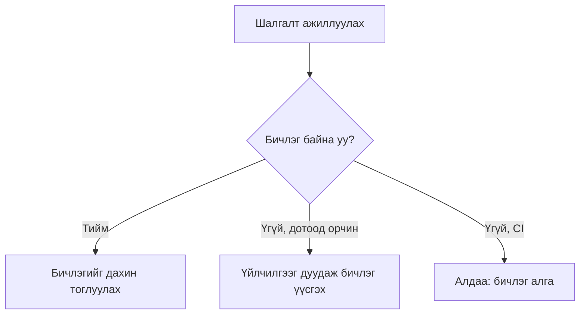

# @mongolgpt/http-recorder

Бодит Effect HTTP болон WebSocket урсгалыг нэг удаа бичиж аваад, дараа нь тогтвортой JSON бичлэгээс дахин тоглуул.

Үүнийг үйлчилгээ холбох ажиллагаа, давтан оролдлого, тогтмол шалгалт, олон алхамт урсгал, мөн гараар бичсэн HTTP дуураймал нь бодит хүсэлтийн хэлбэрийг хэт их халхалдаг бүх шалгалтад ашигла.

> Нийтийн beta. API нь Effect 4 beta-гаас хамаардаг бөгөөд Effect-ийн тогтворжоогүй дамжуулалтын модулиудтай хамт өөрчлөгдөж магадгүй.

## Суулгах

```sh
bun add effect@4.0.0-beta.74
bun add -d @mongolgpt/http-recorder@beta @effect/vitest vitest
```

Энэ багц Node.js 22+ болон Bun-ийг дэмжинэ. Хөтөч, Worker эсвэл Deno орчинд зориулагдаагүй.

Effect `4.0.0-beta.74` дээр мэдэгдэж буй төрлийн зарлалын алдаа бий (`SchemaErrorTypeId` дутуу). Үндсэн эхийн зарлал засагдах хүртэл TypeScript хэрэглэгчдэд дараах тохиргоо хэрэгтэй:

```json
{
  "compilerOptions": {
    "skipLibCheck": true
  }
}
```

## Хурдан эхлэх

```ts
import { assert, describe, it } from "@effect/vitest"
import { Effect, Schema } from "effect"
import { HttpClient, HttpClientRequest } from "effect/unstable/http"
import { HttpRecorder } from "@mongolgpt/http-recorder"

const User = Schema.Struct({
  id: Schema.Number,
  name: Schema.String,
})

const getUser = Effect.gen(function* () {
  const http = yield* HttpClient.HttpClient
  const response = yield* http.execute(HttpClientRequest.get("https://jsonplaceholder.typicode.com/users/1"))
  return yield* Schema.decodeUnknownEffect(User)(yield* response.json)
})

describe("getUser", () => {
  it.effect("loads a user", () =>
    Effect.gen(function* () {
      const user = yield* getUser

      assert.strictEqual(user.id, 1)
      assert.strictEqual(user.name, "Leanne Graham")
    }).pipe(Effect.provide(HttpRecorder.http("users/get-one"))),
  )
})
```

Шалгалтыг Vitest-ээр ажиллуул. Дотоод орчны эхний ажиллуулалт бодит API-г дуудаж, дараах бичлэгийг үүсгэнэ:

```sh
bunx vitest run users.test.ts
```

```text
test/fixtures/recordings/users/get-one.json
```

Дараагийн ажиллуулалтууд үндсэн сервертэй холбогдохгүйгээр уг бичлэгийг дахин тоглуулна. `CI=true` үед бичлэг байхгүй бол шинээр үүсгэхийн оронд алдаа гаргана.



Хэрэглээний код хариу нь бодитоор ирсэн үү эсвэл дахин тоглуулсан уу гэдгийг мэдэх шаардлагагүй.

## API

```ts
HttpRecorder.http(name, options?)
HttpRecorder.socket(name, options?)
```

Энэ нь нийтэд нээлттэй API-ийн бүрэн жагсаалт. `http` нь `fetch`-д тулгуурласан, бичлэгтэй `HttpClient` өгнө. `socket` нь доороос өгсөн энгийн Effect `Socket.Socket`-ийг бичлэгийн боломжтой болгон бүрхэнэ.

## WebSockets

WebSocket бичлэг нь клиент болон серверийн текст эсвэл хоёртын frame-үүдийн дарааллыг хадгална. Дахин тоглуулахдаа уг дарааллыг яг баримтална. Дараагийн бичигдсэн клиент frame хүртэл серверийн frame-үүдийг гаргаад, клиент тохирох frame илгээхийг хүлээсний дараа үргэлжилнэ.

```ts
import { assert, it } from "@effect/vitest"
import { NodeSocket } from "@effect/platform-node"
import { Effect, Layer } from "effect"
import { Socket } from "effect/unstable/socket"
import { HttpRecorder } from "@mongolgpt/http-recorder"

const echo = Effect.gen(function* () {
  const socket = yield* Socket.Socket
  const write = yield* socket.writer

  yield* socket.runString(
    (message) =>
      Effect.gen(function* () {
        assert.strictEqual(message, "hello")
        yield* write(new Socket.CloseEvent(1000))
      }),
    { onOpen: write("hello") },
  )
})

const recordedSocket = HttpRecorder.socket("echo/hello").pipe(
  Layer.provide(
    NodeSocket.layerWebSocket("wss://ws.postman-echo.com/raw", {
      closeCodeIsError: (code) => code !== 1000,
    }),
  ),
)

it.effect("exchanges WebSocket frames", () => echo.pipe(Effect.provide(recordedSocket)))
```

Аппын код ердийн Effect layer холболтоор WebSocket URL болон протоколоо өөрөө удирдана. Бичигч нь socket-ийн URL-ийг өөрийн тохиргоонд давхар бичилгүйгээр түүнийг бүрхэнэ. Тусдаа endpoint эсвэл зэрэгцээ холболт бүрд тусдаа socket layer өгнө.

Текст frame-үүд HTTP body-той адил JSON талбар болон body халхлах дүрэм ашиглана. Хоёртын frame-үүд алдагдалгүй base64 хэлбэрээр хадгалагдана. Дахин тоглуулах үед клиент болон серверийн frame-ийн төрөл таарах ёстой.

## Бичлэг шинэчлэх

Солихыг хүсэж буй бичлэгүүдээ яг таг устгаад, дараа нь тухайн шалгалтуудаа дахин ажиллуул:

```sh
rm test/fixtures/recordings/users/get-one.json
bun run test users.test.ts
```

Зориуд нийтэд нээлттэй дарж солих горим байхгүй. Устгах арга нь аль бичлэгүүд шинэчлэгдэж байгааг ил тод, хянах боломжтой байлгадаг.

## Нууц мэдээлэл халхлах

Аюулгүй анхны тохиргоо ихэнх header-ийг хасаж, header, URL болон JSON body дахь түгээмэл нууц мэдээллийг халхална. Layer байгуулахдаа уг тохиргоог өргөтгөж болно:

```ts
HttpRecorder.http("anthropic/messages", {
  redact: {
    headers: ["x-project-token"],
    allowRequestHeaders: ["anthropic-version"],
    queryParameters: ["session-id"],
    jsonFields: ["user_id"],
    url: (url) => url.replace(/\/accounts\/[^/]+/, "/accounts/{account}"),
    body: (body) => body.replaceAll(/usr_[a-z0-9]+/g, "usr_redacted"),
  },
})
```

| Тохиргоо               | Зориулалт                                                                      |
| ---------------------- | ------------------------------------------------------------------------------ |
| `headers`              | Нэмэлт мэдрэмтгий header нэр нэмнэ. Утгыг `[REDACTED]` хэлбэрээр хадгална.     |
| `allowRequestHeaders`  | Тулгалтад хэрэгтэй, мэдрэмтгий бус нэмэлт хүсэлтийн header-ийг хадгална.       |
| `allowResponseHeaders` | Дахин тоглуулахад хэрэгтэй, мэдрэмтгий бус нэмэлт хариуны header-ийг хадгална. |
| `queryParameters`      | URL-ийн мэдрэмтгий query параметрийн нэр нэмнэ.                                |
| `jsonFields`           | Хүсэлт, хариу дахь таарах JSON түлхүүрийг бүх түвшинд халхална.                |
| `url`                  | Суурь халхлалтын дараа URL-ийг тогтворжуулна.                                  |
| `body`                 | Суурь JSON халхлалтын дараа хүсэлт болон хариуны body-г тогтворжуулна.         |

Бичихийн өмнө бичигч нь бичлэг бүхэлдээ нууц мэдээлэлтэй төстэй орчны хувьсагчийн утга болон түгээмэл нууц түлхүүрийн хэлбэр агуулсан эсэхийг шалгана. Аюултай бичлэг илэрвэл одоо байгаа бичлэгийг солилгүй алдаа гаргана.

Халхлалт нь давхар хамгаалалт болохоос хянан шалгалтыг орлох зүйл биш. Репод оруулахын өмнө бичлэгийн өөрчлөлтийн ялгааг заавал шалга.

## Тулгалт ба дараалал

Бичлэг нь дараалсан харилцан үйлдлүүдийн цувааг агуулна. Ажиллах үеийн эхний хүсэлтийг эхний бичигдсэн хүсэлттэй, хоёр дахьг нь хоёр дахьтой нь, энэ мэтээр тулган шалгана.

Ийм хатуу дараалал нь давтан оролдлого, тогтмол шалгалт, түр санах ойн шалгалт зэрэг ижил хүсэлт давтагдавч хариу нь өөрчлөгддөг нөхцөлийг зөв загварчилна. JSON объектын түлхүүрүүдийг тулгахын өмнө нэгдсэн дараалалд оруулна.

Зэрэгцээ хүсэлтүүдийн хариуны дараалал зөрсөн байсан ч хүсэлт эхэлсэн дарааллаар нь бичиж авна.

Хүсэлтэд зориуд өөрчлөгддөг өгөгдөл байвал ижилд тооцох өөрийн дүрмийг өг:

```ts
HttpRecorder.http("events/create", {
  match: (incoming, recorded) =>
    incoming.method === recorded.method && new URL(incoming.url).pathname === new URL(recorded.url).pathname,
})
```

## Тохиргоо

```ts
interface RecorderOptions {
  readonly directory?: string
  readonly metadata?: Record<string, unknown>
  readonly redact?: RedactOptions
  readonly match?: RequestMatcher
}
```

`directory`-ийн анхны утга нь `<cwd>/test/fixtures/recordings`.

## Бичлэгүүд

Бичлэгүүд нь шалгалттайгаа хамт репод оруулахад зориулсан, уншихад ойлгомжтой JSON файл. HTTP харилцан үйлдлийг хүсэлтийн дарааллаар хадгална. WebSocket бичлэг клиент болон серверийн frame-ийн ажиглагдсан дарааллыг хадгална. Текст уншихад ойлгомжтой хэвээр үлдэж, хоёртын body болон frame-ийг алдагдалгүй base64 хэлбэрээр хадгална.

## Одоогийн хязгаарлалт

- Бичих болон дахин тоглуулах явцад хариуг buffer-т хадгалдаг тул энэ beta нь урсгалын хугацаа, цуцлалт эсвэл эсрэг даралтыг шалгах шалгалтад тохирохгүй.
- WebSocket дахин тоглуулалт frame-ийн дараалал болон агуулгыг хадгалах боловч бодит сүлжээний хугацаа, эсрэг даралтыг хадгалахгүй.
- WebSocket V1 бичлэг төгсгөлийн хаалтын код, шалтгаан эсвэл дамжуулалтын алдааг дахин үүсгэхгүй. Алдаатай болон дундаас тасалдсан бодит ажиллуулалтыг бичихгүй.
- WebSocket тэмдэглэлийг холболт дуусах хүртэл санах ойд хадгалдаг тул төгсгөлгүй session-д энэ beta-г ашиглахаас зайлсхий.
- Одоогоор энэ багцад дээр дурдсан Effect beta-ийн яг тэр хувилбар шаардлагатай.
- Бичлэгийн `1` дүгээр хэлбэрт шилжүүлгийн хэрэгсэл хараахан байхгүй.

## Лиценз

MIT
