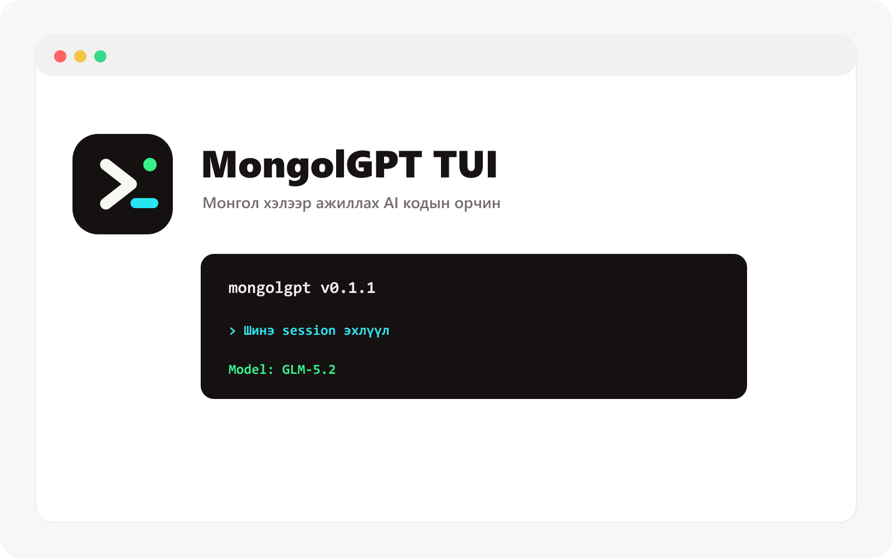

import { Tabs, TabItem } from "@astrojs/starlight/components"
import config from "../../../../config.mjs"
export const console = config.console

[**MongolGPT**](/) คือเอเจนต์การเข้ารหัส AI แบบโอเพ่นซอร์ส มีให้บริการในรูปแบบอินเทอร์เฟซบน terminal แอปเดสก์ท็อป หรือส่วนขยาย IDE



มาเริ่มกันเลย

---

#### ข้อกำหนดเบื้องต้น

หากต้องการใช้ MongolGPT ใน terminal คุณจะต้องมี:

1. terminal อีมูเลเตอร์ที่ทันสมัยเช่น:
   - [WezTerm](https://wezterm.org) ข้ามแพลตฟอร์ม
   - [Alacritty](https://alacritty.org) ข้ามแพลตฟอร์ม
   - [Ghostty](https://ghostty.org), Linux และ macOS
   - [Kitty](https://sw.kovidgoyal.net/kitty/), Linux และ macOS

2. API Key สำหรับผู้ให้บริการ LLM ที่คุณต้องการใช้

---

## Суулгах

Одоогоор MongolGPT-ийн албан ёсны npm/Homebrew/AUR/Chocolatey/Scoop package нийтлэгдээгүй. Бодитоор ажиллах замууд:

- Desktop: [Windows x64 installer](https://github.com/sergei10a-rgb/mongolgpt/releases/latest/download/mongolgpt-desktop-win-x64.exe)
- Source build:

```bash
git clone https://github.com/sergei10a-rgb/mongolgpt
cd mongolgpt
bun install
bun run dev
```

Terminal install script:

```bash
curl -fsSL https://mongolgpt.duckdns.org/install | bash
```

## กำหนดค่า

ด้วย MongolGPT คุณสามารถใช้ผู้ให้บริการ LLM ใดก็ได้โดยกำหนดค่าคีย์ API

หากคุณยังใหม่ต่อการใช้ผู้ให้บริการ LLM เราขอแนะนำให้ใช้ [MongolGPT Zen](/docs/zen)
เป็นรายการโมเดลที่ได้รับการดูแลจัดการซึ่งได้รับการทดสอบและตรวจสอบโดย MongolGPT
ทีม.

1. เรียกใช้คำสั่ง `/connect` ใน TUI เลือก mongolgpt และไปที่ [mongolgpt.duckdns.org/auth](https://mongolgpt.duckdns.org/auth)

   ```txt
   /connect
   ```

2. ลงชื่อเข้าใช้ เพิ่มรายละเอียดการเรียกเก็บเงินของคุณ และคัดลอกรหัส API ของคุณ

3. วางคีย์ API ของคุณ

   ```txt
   ┌ API key
   │
   │
   └ enter
   ```

หรือคุณสามารถเลือกหนึ่งในผู้ให้บริการรายอื่นได้ [เรียนรู้เพิ่มเติม](/docs/providers#ไดเรกทอรี)

---

## เริ่มต้น

เมื่อคุณได้กำหนดค่าผู้ให้บริการแล้ว คุณสามารถนำทางไปยังโปรเจ็กต์นั้นได้
คุณอยากทำงานต่อ

```bash
cd /path/to/project
```

และเรียกใช้ MongolGPT

```bash
mongolgpt
```

จากนั้น เริ่มต้น MongolGPT สำหรับโปรเจ็กต์โดยการรันคำสั่งต่อไปนี้

```bash frame="none"
/init
```

นี่จะได้รับ MongolGPT เพื่อวิเคราะห์โครงการของคุณและสร้างไฟล์ `AGENTS.md`
รากของโครงการ

:::tip
คุณควรคอมมิตไฟล์ `AGENTS.md` ของโปรเจ็กต์ของคุณไปที่ Git
:::

ซึ่งจะช่วยให้ MongolGPT เข้าใจโครงสร้างโปรเจ็กต์และรูปแบบการเขียนโค้ด
ใช้แล้ว.

---

## การใช้งาน

ตอนนี้คุณพร้อมที่จะใช้ MongolGPT เพื่อทำงานในโครงการของคุณแล้ว อย่าลังเลที่จะถามมัน
อะไรก็ตาม!

หากคุณยังใหม่ต่อการใช้เอเจนต์การเข้ารหัส AI ต่อไปนี้คือตัวอย่างบางส่วนที่อาจเป็นไปได้
ช่วย.

---

### ถามคำถาม

คุณสามารถขอให้ MongolGPT อธิบาย codebase ให้คุณได้

:::tip
ใช้ปุ่ม `@` เพื่อค้นหาไฟล์ในโครงการอย่างคลุมเครือ
:::

```txt frame="none" "@packages/functions/src/api/index.ts"
How is authentication handled in @packages/functions/src/api/index.ts
```

สิ่งนี้มีประโยชน์หากมีส่วนหนึ่งของโค้ดเบสที่คุณไม่ได้ดำเนินการ

---

### เพิ่มคุณสมบัติ

คุณสามารถขอให้ MongolGPT เพิ่มคุณสมบัติใหม่ให้กับโครงการของคุณได้ แม้ว่าเราจะแนะนำให้ขอให้สร้างแผนก่อนก็ตาม

1. **สร้างแผน**

   MongolGPT มีโหมด _Plan_ ที่ปิดการใช้งานความสามารถในการเปลี่ยนแปลงและ
   แนะนำ _how_ ว่าจะใช้งานฟีเจอร์นี้แทน

   เปลี่ยนไปใช้ปุ่ม **Tab** คุณจะเห็นตัวบ่งชี้นี้ที่มุมขวาล่าง

   ```bash frame="none" title="Switch to Plan mode"
   <TAB>
   ```

   ตอนนี้เรามาอธิบายสิ่งที่เราต้องการให้ทำ

   ```txt frame="none"
   When a user deletes a note, we'd like to flag it as deleted in the database.
   Then create a screen that shows all the recently deleted notes.
   From this screen, the user can undelete a note or permanently delete it.
   ```

   คุณต้องการให้รายละเอียด MongolGPT เพียงพอเพื่อทำความเข้าใจสิ่งที่คุณต้องการ มันช่วยได้
   เพื่อพูดคุยเหมือนคุณกำลังพูดคุยกับนักพัฒนารุ่นน้องในทีมของคุณ

   :::tip
   ให้บริบทและตัวอย่างมากมายแก่ MongolGPT เพื่อช่วยให้เข้าใจสิ่งที่คุณ
   ต้องการ.
   :::

2. **ทบทวนแผน**

   เมื่อมีแผนแล้ว คุณสามารถให้ข้อเสนอแนะหรือเพิ่มรายละเอียดเพิ่มเติมได้

   ```txt frame="none"
   We'd like to design this new screen using a design I've used before.
   [Image #1] Take a look at this image and use it as a reference.
   ```

   :::tip
   ลากและวางรูปภาพลงใน terminal เพื่อเพิ่มลงในพรอมต์
   :::

   MongolGPT สามารถสแกนรูปภาพที่คุณให้มาและเพิ่มลงในข้อความแจ้งได้ คุณสามารถ
   ทำได้โดยลากและวางรูปภาพลงใน terminal

3. **สร้างฟีเจอร์**

   เมื่อคุณรู้สึกพอใจกับแผนแล้ว ให้เปลี่ยนกลับเป็น _Build mode_ ภายใน
   กดปุ่ม **Tab** อีกครั้ง

   ```bash frame="none"
   <TAB>
   ```

   และขอให้ทำการเปลี่ยนแปลง

   ```bash frame="none"
   Sounds good! Go ahead and make the changes.
   ```

---

### ทำการเปลี่ยนแปลง

หากต้องการการเปลี่ยนแปลงที่ตรงไปตรงมามากขึ้น คุณสามารถขอให้ MongolGPT สร้างมันโดยตรงได้
โดยไม่ต้องทบทวนแผนก่อน

```txt frame="none" "@packages/functions/src/settings.ts" "@packages/functions/src/notes.ts"
We need to add authentication to the /settings route. Take a look at how this is
handled in the /notes route in @packages/functions/src/notes.ts and implement
the same logic in @packages/functions/src/settings.ts
```

คุณต้องการให้แน่ใจว่าคุณให้รายละเอียดในปริมาณที่เหมาะสมเพื่อให้ MongolGPT ดำเนินการได้ถูกต้อง
การเปลี่ยนแปลง

---

### เลิกทำการเปลี่ยนแปลง

สมมติว่าคุณขอให้ MongolGPT ทำการเปลี่ยนแปลงบางอย่าง

```txt frame="none" "@packages/functions/src/api/index.ts"
Can you refactor the function in @packages/functions/src/api/index.ts?
```

แต่คุณก็รู้ว่ามันไม่ใช่สิ่งที่คุณต้องการ คุณ **สามารถยกเลิก** การเปลี่ยนแปลงได้
โดยใช้คำสั่ง `/undo`

```bash frame="none"
/undo
```

MongolGPT จะคืนค่าการเปลี่ยนแปลงที่คุณทำและแสดงข้อความต้นฉบับของคุณ
อีกครั้ง.

```txt frame="none" "@packages/functions/src/api/index.ts"
Can you refactor the function in @packages/functions/src/api/index.ts?
```

จากที่นี่ คุณสามารถปรับแต่งข้อความแจ้งและขอให้ MongolGPT ลองอีกครั้ง

:::tip
คุณสามารถเรียกใช้ `/undo` ได้หลายครั้งเพื่อเลิกทำการเปลี่ยนแปลงหลายรายการ
:::

หรือคุณสามารถ **สามารถทำซ้ำ** การเปลี่ยนแปลงโดยใช้คำสั่ง `/redo`

```bash frame="none"
/redo
```

---

## แบ่งปัน

การสนทนาที่คุณมีกับ MongolGPT สามารถ [แชร์กับคุณได้
ทีมงาน](/docs/share)

```bash frame="none"
/share
```

การดำเนินการนี้จะสร้างลิงก์ไปยังการสนทนาปัจจุบันและคัดลอกไปยังคลิปบอร์ดของคุณ

:::note
การสนทนาจะไม่ถูกแชร์โดยค่าเริ่มต้น
:::

นี่คือ [ตัวอย่างการสนทนา](https://mongolgpt.duckdns.org/s/4XP1fce5) กับ MongolGPT

---

## ปรับแต่ง

แค่นั้นแหละ! ตอนนี้คุณเป็นมืออาชีพในการใช้ MongolGPT แล้ว

หากต้องการทำให้เป็นของคุณเอง เราขอแนะนำให้ [เลือกธีม](/docs/themes), [ปรับแต่งปุ่มลัด](/docs/keybinds), [กำหนดค่าตัวจัดรูปแบบโค้ด](/docs/formatters), [สร้างคำสั่งที่กำหนดเอง](/docs/commands) หรือลองใช้ [การกำหนดค่า MongolGPT](/docs/config)
