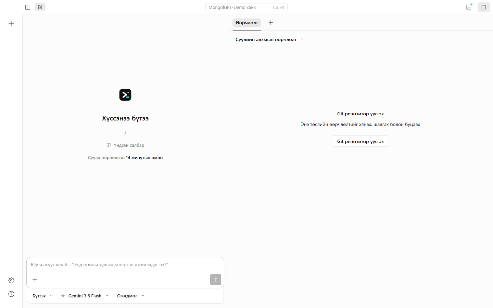
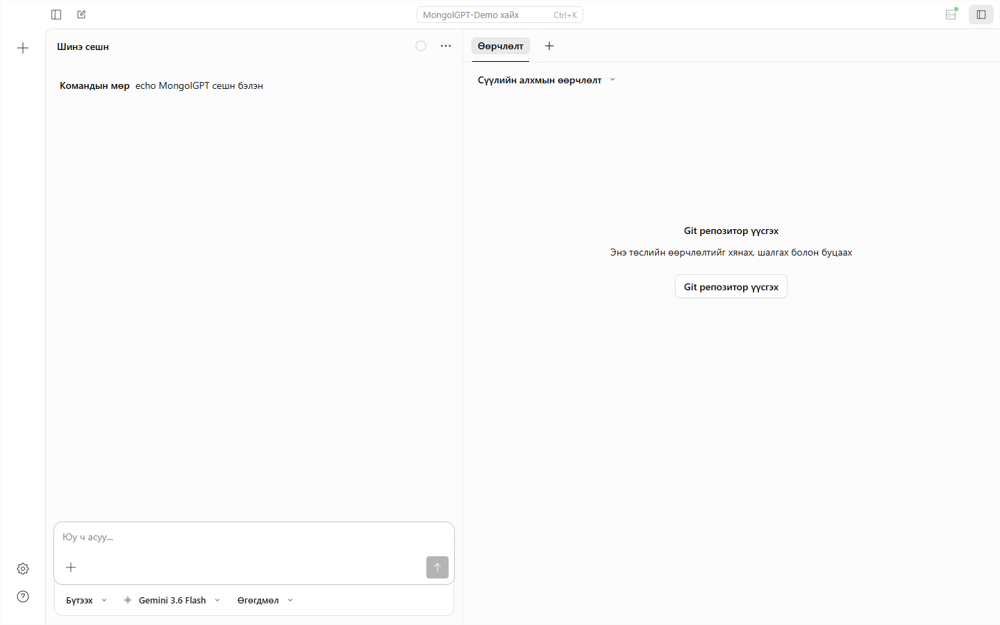
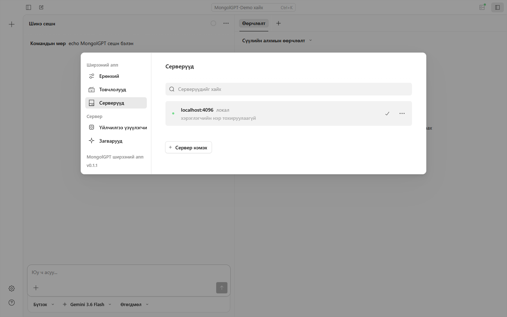

MongolGPT-ийг серверт байршуулсан Web програм эсвэл CLI-ийн локал вэб интерфэйсээр ашиглаж болно. Энэ хоёр орчин ижил харагдаж болох ч файлын систем, бүртгэл болон сүлжээний хандалт нь өөр.

## Серверт байршуулсан Web програм

Үйлдвэрлэлийн нээлтийн дараах Web хаяг нь `https://app.mgpt.mn`. Хөгжүүлэлтийн туршилтыг зөвхөн `https://app.dev.mgpt.mn` дээр хийж, бодит төлбөрийн мэдээлэл оруулахгүй.

Web програмд MongolGPT бүртгэлээр нэвтэрч ажлын талбар, сессийн түүх, хэрэглээний төлөв болон үйлчилгээ үзүүлэгчийн тохиргоог шалгана. Нийтийн Web програм хэрэглэгчийн компьютерийн `localhost`, файл, Git эсвэл терминалд шууд хандахгүй. Локал төсөл дээр ажиллуулах бол [Desktop](../desktop), [CLI](../cli) эсвэл хамгаалалттай локал холбогч ашиглана.

Анхны нэвтрэлтээс загварын туршилт хүртэлх дарааллыг [Анхны эхлэл](../launch) хуудаснаас харна уу.

## Локал вэб интерфэйс

CLI-ийн вэб интерфэйс нь локал сервер ажиллуулж, тухайн төхөөрөмжийн сессүүдийг хөтчөөс удирдах боломж олгоно. Эхний туршилтаа зөвхөн `127.0.0.1` дээр хийнэ үү.



## Эхлүүлэх

CLI ажиллаж байгааг эхлээд шалгана.

```bash
mongolgpt --version
mongolgpt web
```

MongolGPT боломжтой локал порт сонгож, анхдагч хөтөч дээр интерфэйсийг нээнэ. Тогтмол порт хэрэгтэй бол:

```bash
mongolgpt web --port 4096
```

Хөтөч автоматаар нээгдэхгүй бол терминалд харуулсан `http://127.0.0.1:<port>` хаягийг гараар нээнэ.

:::tip[Windows]
CLI-г Windows дээр шууд ажиллуулж болно. Файлын ажиллагаа удаан эсвэл бүрхүүлийн хэрэгслүүд зөрчилдвөл [WSL зааврыг](../windows-wsl) дагаж, төслөө WSL-ийн Linux файлын системд байрлуулаарай.
:::

## Хандалтыг хамгаалах

`127.0.0.1` нь зөвхөн тухайн компьютероос хандана. Харин `0.0.0.0` эсвэл сүлжээний IP дээр сонсох үед нууц үг заавал тохируул.

macOS, Linux, WSL дээр:

```bash
MONGOLGPT_SERVER_PASSWORD="урт-санамсаргүй-нууц-үг" mongolgpt web --hostname 0.0.0.0 --port 4096
```

Windows PowerShell дээр:

```powershell
$env:MONGOLGPT_SERVER_PASSWORD = "урт-санамсаргүй-нууц-үг"
mongolgpt web --hostname 0.0.0.0 --port 4096
```

Өгөгдмөл хэрэглэгчийн нэр `mongolgpt`. Өөрчлөх бол `MONGOLGPT_SERVER_USERNAME`-г тохируулна.

:::caution
Нууц үггүй серверийг `0.0.0.0` дээр бүү ажиллуул, интернет рүү шууд бүү нээ. Алсын хандалтад HTTPS урвуу прокси, firewall, VPN эсвэл SSH tunnel ашиглаж, үйлчилгээ үзүүлэгчийн API түлхүүр болон сессийн мэдээллээ хамгаална.
:::

## Сүлжээний тохиргоо

### Хостын нэр

Дотоод сүлжээний бусад төхөөрөмжөөс хандах:

```bash
mongolgpt web --hostname 0.0.0.0 --port 4096
```

Ажиллах үед дараахтай төстэй хаягууд харагдана.

```txt
Локал хандалт:      http://localhost:4096
Сүлжээний хандалт:  http://192.168.1.100:4096
```

### mDNS илрүүлэлт

Нэг дотоод сүлжээнд серверийг `mongolgpt.local` нэрээр илрүүлэх:

```bash
mongolgpt web --mdns
```

Нэг сүлжээнд хэд хэдэн сервер ажиллуулах бол нэрийг тусад нь өгнө.

```bash
mongolgpt web --mdns --mdns-domain myproject.local
```

### CORS тохиргоо

Тусдаа вэб клиентээс HTTP API дуудах шаардлагатай үед зөвхөн хэрэгтэй origin-ийг нэмнэ.

```bash
mongolgpt web --cors https://app.example.com
```

`--cors *` маягийн өргөн зөвшөөрөл бүү ашигла. Командын мөрийн сонголт нь [тохиргооны файлаас](../config) давуу үйлчилнэ.

## Вэб интерфэйс ашиглах

Нүүр хуудаснаас шинэ сесс эхлүүлэх, идэвхтэй сесс рүү орох, серверийн төлөв харах боломжтой.



Холбогдсон серверүүдийн жагсаалтыг **Серверүүдийг харах** товчоор нээнэ.



## TUI холбох

Вэб сервер болон TUI-г нэг сессийн төлөвтэй зэрэг ашиглаж болно.

```bash
# Эхний терминалд вэб серверийг ажиллуулна
mongolgpt web --port 4096

# Хоёр дахь терминалд TUI-г холбоно
mongolgpt attach http://localhost:4096
```

Алсын серверт холбохдоо HTTPS хаяг ашиглаж, шаардлагатай бол `--username`, `--password` сонголтыг [CLI-ийн `attach` хэсгээс](../cli#attach) шалгана.

## Тохиргооны файл

Давтан ашиглах серверийн тохиргоог `mongolgpt.json` файлд хадгалж болно.

```json title="mongolgpt.json"
{
  "server": {
    "port": 4096,
    "hostname": "127.0.0.1",
    "mdns": false,
    "cors": ["https://app.example.com"]
  }
}
```

Нууц үгийг тохиргооны файлд бүү хадгал. `MONGOLGPT_SERVER_PASSWORD` орчны хувьсагч эсвэл байгууллагын нууц утгын санг ашиглана.

## Асуудал гарвал

- **Хуудас нээгдэхгүй:** терминалд хэвлэгдсэн порт, URL, firewall-аа шалгана.
- **`EADDRINUSE`:** өөр порт сонгоно, жишээ нь `--port 4097`.
- **`401 Unauthorized`:** хэрэглэгчийн нэр, нууц үгийн орчны хувьсагчаа дахин тохируулна.
- **Хоосон интерфэйс:** түр хадгалсан өгөгдлөө цэвэрлэж дахин нээгээд, CLI бүртгэлийг шалгана.
- **Сүлжээний төхөөрөмжөөс холбогдохгүй:** `--hostname 0.0.0.0`, firewall дүрэм, хоёр төхөөрөмж нэг сүлжээнд байгаа эсэхийг шалгана.

Дэлгэрэнгүй алхмуудыг [алдаа оношлох заавраас](../troubleshooting) үзнэ үү.
